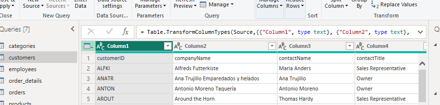
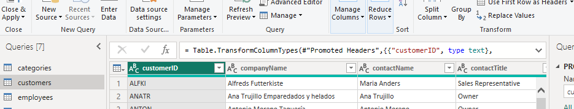
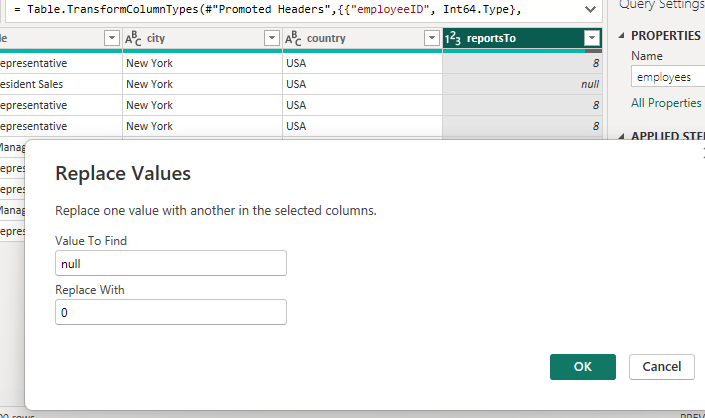
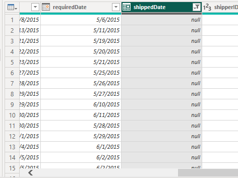
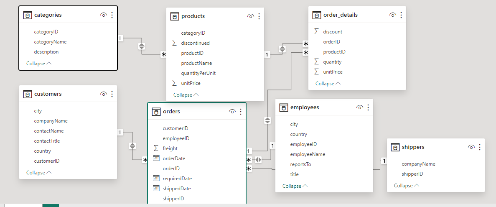

# Data Analysis of Northwind Treaders for the First Half of 2015

## Introduction: 
Data analysis is essential for businesses to understand performance, identify trends, and make informed decisions that drive growth.
As part of the Data-Nex Community Project, I will be analyzing Northwind Traders dataset focusing on the first half of 2015. 
The goal here is to create a 2-page interactive report uncovering insights about product performance and customer behavior.

## Tool Used: 
 Microsoft Power BI for data extraction, transformation, calculations, and visualizations.
 
## Dataset Overview:
The Northwind Traders dataset comprises 7 tables:
- Customers Table: Provides information about the company’s customers, including company names, contact names, and locations.
- Categories Table: Details product categories such as category names and descriptions.
- Employees Table: Contains employee records, including names, titles, and contact information.
- Orders_Detail: Includes purchase details like quantity, unit price, discount, and order dates.
- Orders Table: Includes OrderIDs, employee IDs, order dates, customer IDs, shipping details, etc.
- Products Table: Offers information about the products Northwind Traders sells, including product names, unit prices, and categories.
- Shippers Table: Contains information about shipping companies used by Northwind Traders.

## Problem Statement: 
Northwind Traders, a company known for distributing gourmet food products, wants to make its operations better and decisions smarter in the 2nd half of 2015. To achieve this, the company plans to study its sales data, how customers behave, and how well its products are doing with emphasis on the 1st half of 2015. By doing this, Northwind Traders hopes to find important insights and ways to grow even more.

In their analysis, Northwind Traders wants to look closely at sales trends, how customers buy things, and which products are selling well based on what was achieved in the 1st half of 2015. They believe that by understanding these things better, they can make smarter choices about what to sell and how to sell it. This means they can make sure they have the right products in stock and keep their customers happy.

Northwind Traders knows that using data to make decisions is important. They want to use this information to find ways to make their business better and keep up with what their customers want.
#### Task:
You are to work with the Northwind Traders Data provided. It is also expected that you come up with a 2-page interactive report showing insights that answers the broad problem statement above. Each page can be about a single topic (e.g., Page 1: Customer Behavior, Page 2: Product Performance)
- Carryout all necessary pre-analysis steps and document properly
- Come up with 6-8 critical questions you intend to answer (don’t raise questions not related to the problem at hand) alongside 4-6 single value KPIs/metrics that provides insights into the company’s overall performance
- In addition to creating a 2-page interactive report for the stakeholders at Northwind, provide textual answers to the questions below judging based on the insights you have (the answers you provide should form a part of the recommendations you will provide in your documentation on GitHub):
- What makes customers keep coming back, and how can Northwind Traders use this to get more loyal customers?
- Are there certain products that are selling faster than others, and how can Northwind Traders make sure they always have enough of these in stock?
- Do different types of customers buy different things, and how can Northwind Traders use this information to offer products that people want?

## Methodology and Data Analysis:

### Data Collection: 
The dataset, consisting of seven (7) different CSV files, was shared and imported into Power BI.

### Data Cleaning:
- I ensured right data types were used in all the tables
- Corrected table header in the customer column. (made first rows headers)

##### *original customer table*
---------------------------------

 
##### *updated customer table*

- Found null values in Employees and Orders table, replaced the first with 0, did not remove the second as the columns were not needed for the analysis.

##### *Nulls in the Employee table (Report Column)*

-------------------------------------------------
  

##### *Nulls in Orders table (Shipping_date column)*

## Data modeling:
After various transformations, I loaded the data into Power BI to work on the data model and created a snowflake model

##### *Northwind Data Model*

## Data Visualization and Insights: 
The report covers two pages: Product Performance Analysis and Customer Performance Analysis.

### Formulating Critical Questions and KPIs ( *Product Performance Analysis*)
- What is the net sales for the first half of 2015?
- What is the average discount applied over the last 6 months?
- Number of order placed in the last months
- Total number of products available

  
- Which products drove the highest net sales in the first half of 2015?
- What are the least 5 products, their category and net sales?
- What is the average order value for the top 5 products?
- What impact did discounts have on net sales during the first quarter of 2015?  and how effective were they in driving revenue growth?

### Formulating Critical Questions and KPIs ( *Customer Behavior Analysis*)
What is the net sales for the first half of 2015,
What is the average discount applied over the last 6 months?
Number of order placed in the last months
Total number of products available

Which products drove the highest net sales in the first half of 2015?
What are the least 5 products, their category and net sales?
What is the average order value for the top 5 products?
What impact did discounts have on net sales during the first quarter of 2015?  and how effective were they in driving revenue growth?

 

